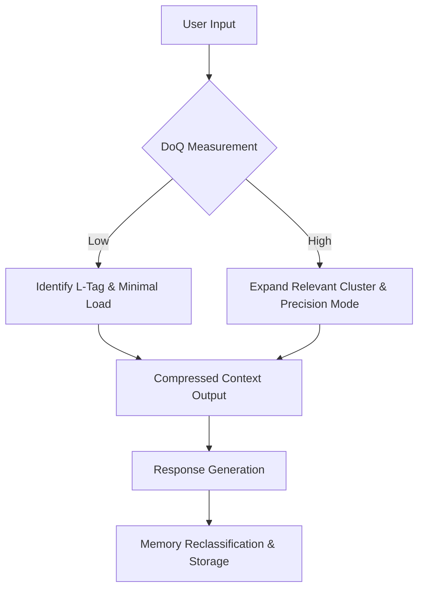

# LoPAS-MCCP
## Memory Compression & Classification Protocol

> **The structural answer to RAG token explosion.**

---　

## Why This Exists

Most AI workflows treat context as a container — fill it with everything, let the model sort it out.

This breaks in three ways:

1. **Token explosion** — cost scales with context size, not with the complexity of the actual question
2. **Meaning layer degradation** — irrelevant chunks contaminate semantic proximity, producing plausible but wrong answers
3. **No entry gate** — every input triggers full context load, regardless of what the input actually requires

MCCP solves the entry problem.  
Before anything is loaded, the input is measured.  
Only what is needed gets activated.

---

## Core Concept: The Cognitive Gateway

All input passes through a single gate before any memory or context is loaded.

The gate measures **DoQ (Density of Question)** — the structural weight of the question embedded in the input.

```
Input → [DoQ Measurement] → [L-Tag Classification] → [Minimum Context Load] → Processing
```

This is not filtering by keyword.  
It is measuring the *type of reasoning the input demands*, then activating only the cluster that serves that reasoning.

---

## Step 1: Condition Matching

**DoQ (Density of Question)** is estimated on a 0–1.0 scale.

| DoQ Range | Mode | Token Saving |
|:---|:---|:---|
| < 0.4 | **Minimal Processing Mode** — load specific indicators only | ~80% |
| ≥ 0.4 | **Precision Analysis Mode** — expand relevant cluster | 30–50% |

Low DoQ inputs (status checks, confirmations, simple retrievals) do not need the full stack.  
High DoQ inputs (causal reasoning, structural diagnosis, phase assessment) expand only the relevant cluster.

---

## Step 2: L-Tag Classification

Once DoQ is measured, the input is assigned one of four **L-Tags**.  
Memory layers that do not match the active L-Tag are blocked from loading.

| Tag ID | Class | Trigger Keywords / Context | Activated Indicators |
|:---|:---|:---|:---|
| **L-STR** | Structural | structure, balance, density, stability, vulnerability | BCDI, SCI, CDI, FTI |
| **L-INF** | Inference | reasoning, prediction, cause, hypothesis, causality | CII, LPI, RII |
| **L-REL** | Relational | connection, resonance, correction, relationship, civilization | CRI, CCI, RVI |
| **L-DYN** | Dynamic | change, transition, persistence, acceleration, cycle | TRS, LPTM, AHI |

Access to non-matching layers is structurally blocked — not filtered, blocked.  
This is the same principle as responsibility layer separation in [RNC](https://github.com/hanabokur0/RNC):  
each layer owns its domain and does not bleed into others.

---

## Step 3: Compression Logic

After classification, two operations reduce context to its minimum viable form.

### Hash-Definition
Non-active indicators are collapsed to a single-line hash.  
Full definitions and calculation logic are purged from active context.

```
# Before
CII: Causal Inference Index
  Formula: Σ(causal_weight × directional_confidence) / n
  Parameters: [list of parameters...]
  Validation: [validation logic...]

# After (non-active)
CII(v1.0):CausalInference_0.2w
```

### Context Pruning
Evidence, logs, and historical data associated with non-active L-Tags are moved to archive layer and removed from active context.  
They are not deleted — they are not present.

---

## Execution Flow



---

## What This Is Not

MCCP is not a prompt engineering technique.  
It is not a retrieval optimization.  
It is not a chunking strategy.

It is an **entry gate** — a structural decision about what should exist in context before any reasoning begins.

The distinction matters because prompt engineering works on top of a loaded context.  
MCCP decides what gets loaded.

---

## Relationship to the LoPAS Stack

MCCP is the input layer of a larger protocol stack.

```
Reality
↓
VisualStructure    — structural observation before translation
↓
TranslatedVoice    — meaning degradation measurement
↓
MCCP               — context compression & classification  ← here
↓
RNC                — input responsibility assignment
↓
LPTM / CAG         — phase and gap sensing
↓
Protocol Engine    — classification and execution
↓
DDA                — judgment condition evaluation
↓
LCA                — learning claim verification
↓
ProtocolMemory     — threshold self-adjustment
```

Each layer owns one responsibility.  
MCCP owns the entry decision.

---

## Coming Next: LoPAS-DRM

MCCP is the first layer of an integrated protocol:  
**LoPAS-DRM (Decision & Responsibility Manager)** — combining MCCP, DDA, and RNC into a unified decision execution flow.

DRM adds:
- Dependency mapping of decision conditions (DDA)
- Responsibility tagging at each decision node (RNC)
- Full audit trail: who decided what, why, and under which contract

> MCCP compresses what enters.  
> DDA structures what remains.  
> RNC stamps who owns what.

---

## Repository

Part of the [LoPAS framework ecosystem](https://github.com/hanabokur0)  
Built inductively from field observation over two years.  
Not derived from theory — theory confirmed it later.
